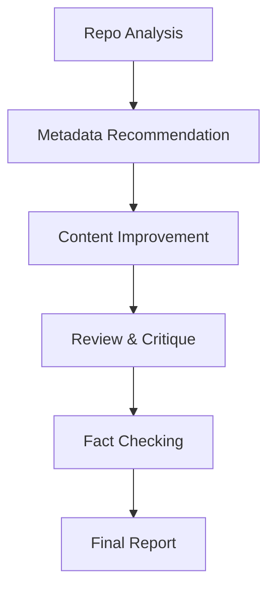
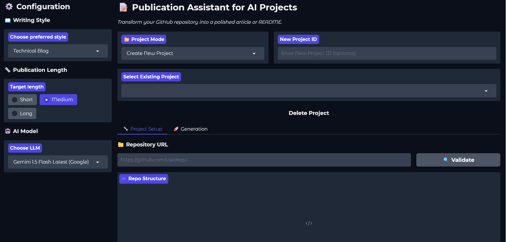
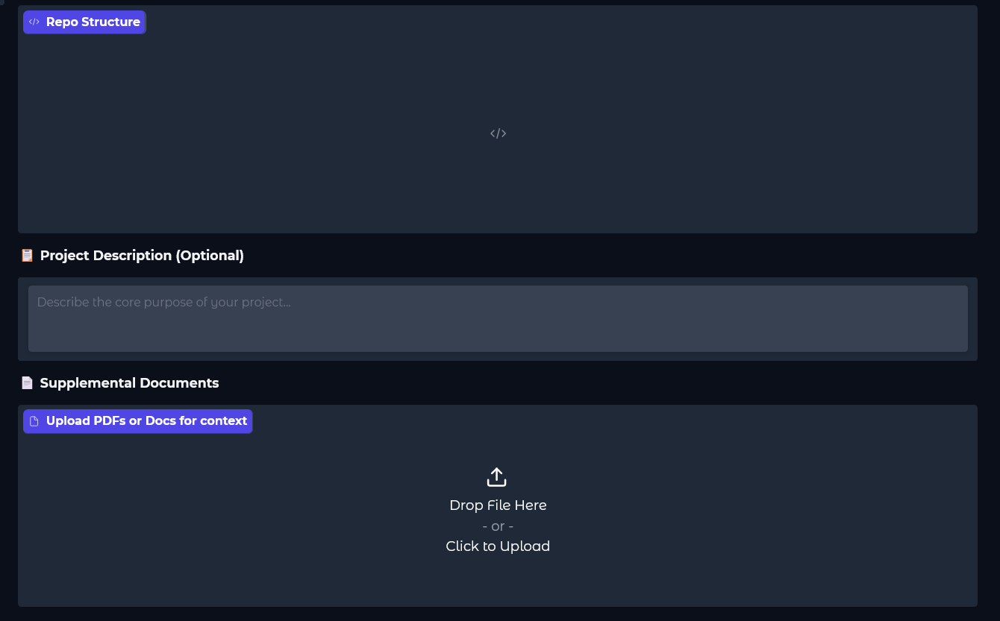
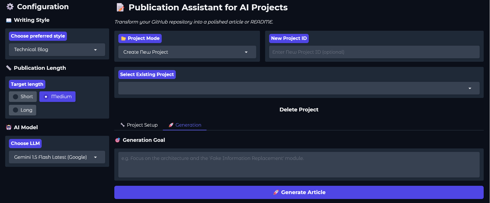

<div align="center">
  
  <br/>
  <h1>🚀 Publication Assistant for AI Projects</h1>
</div>

---

## Project Summary

A Multi-Agent System for Improving the Quality, Discoverability, and Credibility of AI/ML Repositories.

## Overview

**Publication Assistant for AI Projects** is an advanced **multi-agent AI system** that analyzes a GitHub repository and automatically generates **high-quality publication improvements**, including:

- A clearer, more engaging README
- Better project titles and metadata
- Discoverability improvements (tags, keywords)
- Structural and documentation recommendations
- Automated fact-checking of technical claims

The system is built using **LangGraph orchestration**, integrates **multiple specialized agents**, and leverages **tool-augmented reasoning** to go far beyond basic LLM text generation. This project was developed as part of the **Mastering AI Agents** program and demonstrates real-world, production-style agent collaboration.

## Project Description

This project demonstrates mastery of core AI-agent concepts. Here's a breakdown of the design and architecture:

### ✅ Multi-Agent Collaboration

- Multiple agents with **distinct responsibilities**
- Clear handoff of state and artifacts between agents
- Coordinated execution through a shared orchestration graph

### ✅ Agent Orchestration

- Workflow implemented using **LangGraph**
- Deterministic execution order with shared state
- Modular, extensible pipeline design

### ✅ Tool Integration

- Each agent is **tool-augmented**
- Tools extend agent capabilities beyond text generation
- Graceful fallbacks when optional tools are unavailable

### 🧠 System Architecture

The system is composed of **five core agents**, each with a focused role:
| Agent | Responsibility |
| ---------------------------- | -------------------------------------------------------- |
| **RepoAnalyzerAgent** | Parses repository structure, README, and code statistics |
| **MetadataRecommenderAgent** | Suggests project titles, tags, and short descriptions |
| **ContentImproverAgent** | Rewrites and improves README using RAG + web examples |
| **ReviewerCriticAgent** | Scores documentation quality and flags issues |
| **FactCheckerAgent** | Verifies technical claims using arXiv |

All agents are coordinated using a **LangGraph StateGraph**, ensuring clean, reproducible execution.

### 🔁 Orchestration Flow (LangGraph)



Each step enriches the shared state and passes structured outputs to the next agent.

### 🛠️ Tools Used

This project integrates **five tools**, including both built-in and custom implementations:
| Tool | Purpose |
| ----------------------------------------- | ----------------------------------------------- |
| **RepoParser** | Reads local, ZIP, or remote GitHub repositories |
| **KeywordExtractor (Gemini / Heuristic)** | Extracts technical keywords |
| **TavilySearchTool** | Finds similar successful repositories |
| **RAGRetriever (ChromaDB)** | Retrieves best-practice documentation hints |
| **ArxivScholarTool** | Verifies scientific and technical claims |
| **MCPBus (Optional)** | Lightweight pub/sub communication layer |

All tools are optional-dependency-safe and fail gracefully.

### 💡 Key Features

- 🔍 Automatic repository inspection (local, ZIP, or GitHub URL)
- ✍️ README rewriting using **RAG + Web Search**
- 🏷️ Intelligent metadata generation (titles, tags, descriptions)
- 📊 Documentation quality scoring
- 📚 Claim verification using academic sources
- 🧩 Modular and extensible agent design
- 🖥️ CLI and **Gradio App** support

## 📊 Example Results

The system is designed to improve repository presentation across several dimensions:

| Metric                       | Improvement                                              |
| ---------------------------- | -------------------------------------------------------- |
| README completeness          | Increased through structured content suggestions         |
| Installation clarity         | Improved with explicit setup guidance                    |
| Project discoverability      | Strengthened via title, tag, and summary recommendations |
| Missing section detection    | Automated via repository analysis                        |
| Technical claim verification | Supported through arXiv-based checks                     |

> These results are based on the project’s automated workflow and qualitative review of repository documentation patterns.

## ✨ Example Transformation

Before: "A small RAG chatbot project using LangChain."

After: "A retrieval-augmented chatbot with semantic retrieval, vector storage, and conversational memory built with LangChain and ChromaDB."

---

### 📸 Demos & Screenshots

**Interactive Gradio UI (Screenshots):**

<p align="center">
  
  
  
</p>

**Video Walkthrough:**
🎥 [Watch the Video Demo on YouTube/Loom](https://video-link.com)

---

## Tech Stack / Technologies Used

- **Languages**: Python 3.11+
- **Orchestration / LLM Framework**: LangGraph, LangChain
- **LLM Providers**: Groq (Llama-3, Mixtral), Google GenAI (Gemini)
- **Web UI Framework**: Gradio
- **Vector Database (RAG)**: ChromaDB
- **Web Search Integration**: Tavily Python Client
- **Scientific Verification**: ArXiv API

## Repository Structure

```text
Publication Assistant/
├── agents/
│   ├── __init__.py
│   ├── repo_analyzer.py
│   ├── metadata_recommender.py
│   ├── content_improver.py
│   ├── reviewer_critic.py
│   └── fact_checker.py
├── orchestration/
│   ├── __init__.py
│   └── graph.py
├── tools/
│   ├── __init__.py
│   ├── repo_parser.py
│   ├── web_search.py
│   ├── rag_retriever.py
│   ├── keyword_extractor.py
│   └── arxiv_scholar.py
├── utils/
│   ├── __init__.py
│   ├── evaluation.py
│   ├── logging.py
│   └── mcp.py
├── tests/
├── .env.example
├── .gitignore
├── app.py
├── Dockerfile
├── main.py
├── README.md
└── requirements.txt
```

## Installation

### 📋 Prerequisites

Before you begin, make sure you have the following:

- ✅ Python 3.11+
- 🔑 Groq API Key (required)
- 🔑 Google API Key (optional)
- 🔑 Tavily API Key (optional, for web search capabilities)

### 🛠️ Setup and Installation Guide

#### 1️⃣ Clone the Repository

```bash
git clone https://github.com/your-username/publication-assistant.git
cd publication-assistant
```

#### 2️⃣ Install Dependencies

```bash
pip install -r requirements.txt
```

#### 3️⃣ Set Environment Variables

Create a `.env` file:

```env
GOOGLE_API_KEY=your_google_api_key
GROQ_API_KEY=your_groq_api_key
TAVILY_API_KEY=your_tavily_api_key
```

_(Optional tools will still work without this.)_

---

## Usage

Once the application is installed, you can use it via the interactive Gradio app or the command line.

### 🌐 1. Gradio App - Recommended

The Gradio app provides the richest experience for exploring the generated documentation.

**To start the server:**

```bash
python app.py
```

**How to use:**

1. Open your browser and navigate to `http://localhost:7860`.
2. **Project Setup:** Paste a public GitHub Repository URL into the input field and click "Validate".
3. **Configuration:** On the left panel, select your preferred "Writing Style" (e.g., Technical Blog) and "AI Model".
4. **Generation:** Click "Generate Article". The system will trigger the multi-agent pipeline and present the improved README, tags, and titles on the right.

---

### ▶️ 2. Command Line Interface (CLI)

You can directly parse local or remote repositories from your terminal for quick analysis.

**Analyze a local repository:**

```bash
python main.py --repo-path ./some_local_repo
```

**Analyze a remote repository:**

```bash
python main.py --repo-path https://github.com/user/project
```

_The CLI will output a concise report in your terminal containing suggested titles, tags, review scores, and missing sections._

---

## 🧠 Design Principles

- **Separation of Concerns** – each agent has a single responsibility
- **Tool-Augmented Intelligence** – agents do not rely on LLMs alone
- **Fault Tolerance** – optional tools fail gracefully
- **Extensibility** – new agents or tools can be added easily

---

## License

This project is licensed under the MIT License. See [LICENSE](LICENSE) for details.

## 🔮 Future Enhancements

- Formal evaluation metrics against baseline READMEs
- Multi-repo batch analysis
- GitHub Actions integration
- Automatic PR creation with improved README
- Support for MCP over network

## 📖 Citation

If you use this project in research, teaching, or portfolio work, please cite it as:

```text
Abdi Dabala. Publication Assistant for AI Projects. GitHub Repository, 2026.
```

---

## Contributing

Contributions are welcome!
Please open an issue or submit a pull request with clear documentation.

---

### 📜 License

Licensed under the [MIT license](LICENSE).

---

### 📚 References

1. **Ready Tensor** – [Agentic AI Developer Certification](https://app.readytensor.ai/certifications)
2. **LangGraph Framework** – [Official Documentation](https://langchain-ai.github.io/langgraph/)
3. **LangChain** – [Building context-aware reasoning applications](https://python.langchain.com/)
4. **Gradio** – [The fastest way to build & share ML apps](https://www.gradio.app/)
5. **ChromaDB** – [Open-source AI-native embedding database](https://www.trychroma.com/)
6. **Tavily Search** – [Search Engine Optimized for LLMs](https://tavily.com/)
7. **ArXiv API** – [Scholarly Research API](https://info.arxiv.org/help/api/index.html)

---

### 📬 Contact

📧 [abdid.yadata@gmail.com](mailto:abdid.yadata@gmail.com)
