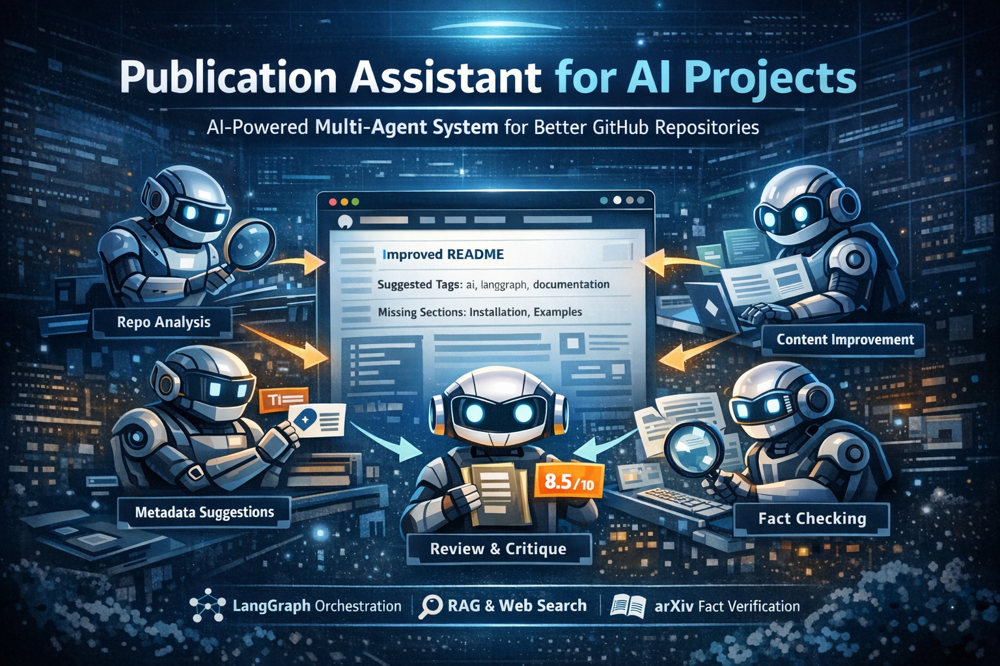

# 📝 Publication Assistant for AI Projects



**A Multi-Agent System for Improving the Quality, Discoverability, and Credibility of AI/ML Repositories**

---

## 📌 Overview

**Publication Assistant for AI Projects** is an advanced **multi-agent AI system** that analyzes a GitHub repository and automatically generates **high-quality publication improvements**, including:

* A clearer, more engaging README
* Better project titles and metadata
* Discoverability improvements (tags, keywords)
* Structural and documentation recommendations
* Automated fact-checking of technical claims

The system is built using **LangGraph orchestration**, integrates **multiple specialized agents**, and leverages **tool-augmented reasoning** to go far beyond basic LLM text generation.

This project was developed as part of the **Mastering AI Agents** program and demonstrates real-world, production-style agent collaboration.

---

## 🎯 Project Objectives

This project demonstrates mastery of the following core AI-agent concepts:

### ✅ Multi-Agent Collaboration

* Multiple agents with **distinct responsibilities**
* Clear handoff of state and artifacts between agents
* Coordinated execution through a shared orchestration graph

### ✅ Agent Orchestration

* Workflow implemented using **LangGraph**
* Deterministic execution order with shared state
* Modular, extensible pipeline design

### ✅ Tool Integration

* Each agent is **tool-augmented**
* Tools extend agent capabilities beyond text generation
* Graceful fallbacks when optional tools are unavailable

---

## 🧠 System Architecture

The system is composed of **five core agents**, each with a focused role:

| Agent                        | Responsibility                                           |
| ---------------------------- | -------------------------------------------------------- |
| **RepoAnalyzerAgent**        | Parses repository structure, README, and code statistics |
| **MetadataRecommenderAgent** | Suggests project titles, tags, and short descriptions    |
| **ContentImproverAgent**     | Rewrites and improves README using RAG + web examples    |
| **ReviewerCriticAgent**      | Scores documentation quality and flags issues            |
| **FactCheckerAgent**         | Verifies technical claims using arXiv                    |

All agents are coordinated using a **LangGraph StateGraph**, ensuring clean, reproducible execution.

---

## 🔁 Orchestration Flow (LangGraph)

```
Repo Analysis
      ↓
Metadata Recommendation
      ↓
Content Improvement (RAG + Web Search)
      ↓
Review & Critique
      ↓
Fact Checking
      ↓
Final Report
```

Each step enriches the shared state and passes structured outputs to the next agent.

---

## 🛠️ Tools Used

This project integrates **five tools**, including both built-in and custom implementations:

| Tool                                      | Purpose                                         |
| ----------------------------------------- | ----------------------------------------------- |
| **RepoParser**                            | Reads local, ZIP, or remote GitHub repositories |
| **KeywordExtractor (Gemini / Heuristic)** | Extracts technical keywords                     |
| **WebSearchTool (DuckDuckGo)**            | Finds similar successful repositories           |
| **RAGRetriever (ChromaDB)**               | Retrieves best-practice documentation hints     |
| **ArxivScholarTool**                      | Verifies scientific and technical claims        |
| **MCPBus (Optional)**                     | Lightweight pub/sub communication layer         |

All tools are optional-dependency-safe and fail gracefully.

---

## 💡 Key Features

* 🔍 Automatic repository inspection (local, ZIP, or GitHub URL)
* ✍️ README rewriting using **RAG + Web Search**
* 🏷️ Intelligent metadata generation (titles, tags, descriptions)
* 📊 Documentation quality scoring
* 📚 Claim verification using academic sources
* 🧩 Modular and extensible agent design
* 🖥️ CLI and **Gradio Web UI** support

---

## 🧪 Example Output

* **Suggested Titles**

  * *Publication Assistant for AI Projects*
  * *Multi-Agent Documentation Improver*
  * *AI-Powered GitHub Readme Optimizer*

* **Suggested Tags**

  ```
  multi-agent, langgraph, rag, ai-agents, documentation, llm-tools
  ```

* **Review Score**

  ```
  8.5 / 10
  ```

* **Missing Sections**

  ```
  Installation, Examples, Contributing
  ```

---

## 🚀 Getting Started

#### 1️⃣ Clone the Repository

```bash
git clone https://github.com/your-username/publication-assistant.git
cd publication-assistant
```

#### 2️⃣ Install Dependencies

```bash
pip install -r requirements.txt
```

#### 3️⃣ Set Environment Variables

Create a `.env` file:

```env
GOOGLE_API_KEY=your_google_api_key
```

(Optional tools will still work without this.)

---

## ▶️ Run from CLI

```bash
python main.py --repo-path ./some_repo
```

Or analyze a remote repository:

```bash
python main.py --repo-path https://github.com/user/project
```

---

## 🌐 Run the Web Interface (Gradio)

```bash
python app.py
```

Then open your browser at:

```
http://localhost:7860
```

---

## 🧩 Project Structure

```
Publication Assistant/
├── agents/
│   ├── __init__.py
│   ├── repo_analyzer.py
│   ├── metadata_recommender.py
│   ├── content_improver.py
│   ├── reviewer_critic.py
│   └── fact_checker.py
│
├── orchestration/
│   ├── __init__.py
│   └── graph.py
│
├── tools/
│   ├── __init__.py
│   ├── repo_parser.py
│   ├── web_search.py
│   ├── rag_retriever.py
│   ├── keyword_extractor.py
│   └── arxiv_scholar.py
│
├── venv
├── utils/
│   ├── __init__.py
│   ├── evaluation.py
│   ├── logging.py
│   └── mcp.py
│
├── .env
├── .env.example
├── .gitignore
├── app.py
├── Dockerfile
├── main.py
├── README.md
└── requirements.txt
```

---

## 🧠 Design Principles

* **Separation of Concerns** – each agent has a single responsibility
* **Tool-Augmented Intelligence** – agents do not rely on LLMs alone
* **Fault Tolerance** – optional tools fail gracefully
* **Extensibility** – new agents or tools can be added easily

---

## 🔮 Future Enhancements

* Formal evaluation metrics against baseline READMEs
* Multi-repo batch analysis
* GitHub Actions integration
* Automatic PR creation with improved README
* Support for MCP over network

---

## 🤝 Contributing

Contributions are welcome!
Please open an issue or submit a pull request with clear documentation.

---
### 📜 License

Licensed under the [MIT license](LICENSE).

---

### 📚 References

1. **Ready Tensor** – [Agentic AI Developer Certification](https://app.readytensor.ai/certifications)

---

### 📬 Contact

📧 [abdid.yadata@gmail.com](mailto:abdid.yadata@gmail.com)

